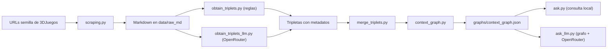

# Proyecto 8: Del sistema experto al context graph

## 1. Introducción

En este proyecto he construido un sistema experto moderno sobre la saga **Final Fantasy** usando como fuente principal varias fichas y listados de **3DJuegos**. La idea del trabajo ha sido recorrer la transición que plantea el enunciado: pasar de un sistema experto clásico basado en conocimiento estructurado a un **context graph** enriquecido con procedencia, fecha y confianza, y combinarlo con un **LLM** como motor de inferencia.

El dominio elegido ha sido la saga Final Fantasy porque reúne varias características que encajan muy bien con el enfoque del proyecto:

- existe una relación clara entre entregas, remakes, plataformas y fechas;
- se pueden formular preguntas multi-hop;
- la procedencia y la vigencia temporal importan;
- la información es lo bastante estructurable como para convertirla en tripletas.

## 2. Objetivo del sistema experto

El objetivo del sistema es responder preguntas sobre juegos de Final Fantasy apoyándose en un grafo de conocimiento con trazabilidad. En concreto, el sistema debe ser capaz de:

- identificar juegos, plataformas, géneros, desarrolladores y fechas;
- representar relaciones como `is_remake_of`, `developed_by`, `published_by` o `available_on`;
- responder preguntas simples y multi-hop;
- citar siempre la fuente y la fecha del hecho utilizado.

## 3. Fuente y justificación

La fuente principal utilizada ha sido **3DJuegos**, especialmente:

- el universo general de Final Fantasy;
- fichas detalladas de juegos concretos como `Final Fantasy VII Remake`, `Final Fantasy VII Rebirth` y `Final Fantasy XVI`.

Se eligió esta fuente porque:

- ofrece páginas razonablemente estructuradas;
- contiene campos útiles para convertir en tripletas;
- combina información general del universo con fichas concretas;
- permite demostrar el valor de la procedencia y la vigencia temporal.

## 4. Arquitectura del sistema

El pipeline final combina una parte determinista y una parte generativa:

### Componentes principales

- `src/scraping.py`: descarga páginas en Markdown usando `r.jina.ai`.
- `src/obtain_triplets.py`: extrae tripletas mediante reglas sobre el texto.
- `src/obtain_triplets_llm.py`: extrae tripletas con OpenRouter.
- `src/merge_triplets.py`: combina la extracción por reglas con la extracción LLM.
- `src/context_graph.py`: construye el grafo final y genera una visualización parcial.
- `src/ask.py`: responde preguntas consultando el grafo de forma local.
- `src/ask_llm.py`: recupera evidencia del grafo y usa un LLM como motor de inferencia final.

## 5. Sistema experto clásico frente a context graph

La correspondencia con un sistema experto clásico es la siguiente:

- **Base de conocimiento**: el grafo de tripletas.
- **Motor de inferencia**: recuperación de evidencia desde el grafo y, en la versión final, redacción razonada con LLM.
- **Interfaz de usuario**: scripts de consulta como `ask.py` y `ask_llm.py`.

La ampliación a **context graph** se consigue añadiendo metadatos por arista:

- `source`
- `fecha_extraccion`
- `valido_desde`
- `valido_hasta`
- `confianza`

Esto permite no solo saber **qué hecho existe**, sino también **de dónde sale**, **cuándo se extrajo** y **qué validez temporal o nivel de confianza tiene**.

## 6. Modelado y construcción del grafo

El proyecto genera dos versiones:

- **baseline**: grafo con tripletas sin metadatos;
- **context graph**: grafo con tripletas enriquecidas.

Resultados de la ejecución final:

- aristas baseline: `626`
- aristas en el context graph híbrido: `653`
- nodos en el context graph final: `450`
- tripletas añadidas mediante LLM: `39`
- aristas con fecha de vigencia: `152`
- aristas con fuente trazable: `653`

Este aumento no es solo cuantitativo. Las tripletas LLM han mejorado relaciones semánticas especialmente útiles en la consulta:

- `is_remake_of`
- `developed_by`
- `published_by`
- `has_type`

## 7. Visualización del grafo

Se ha generado una visualización parcial del context graph en:

- `figures/context_graph.svg`

En ella se representan juegos, plataformas, géneros, empresas, fechas y relaciones del universo Final Fantasy. La visualización se ha limitado a una parte del grafo para mantener la legibilidad, tal como pide el enunciado.

## 8. Preguntas y respuestas

### Pregunta 1

**¿Qué juegos de Final Fantasy salieron en PS5 después de 2020?**

Respuesta del sistema:

- **Final Fantasy XVI**, con salida en PS5 el **22 de junio de 2023**.  
  Fuente: `https://www.3djuegos.com/universo/0f0f0f0/11/final-fantasy/`
- **Final Fantasy VII: Rebirth**, con fecha de lanzamiento el **29 de febrero de 2024** y evidencia de disponibilidad en PS5.  
  Fuente: `https://www.3djuegos.com/juegos/final-fantasy-vii-rebirth/`

Esta pregunta demuestra el uso conjunto de:

- relación `available_on`;
- relación `released_on`;
- filtrado temporal posterior a 2020.

### Pregunta 2

**¿Qué entregas de Final Fantasy aparecen como remakes?**

Respuesta del sistema:

- **Final Fantasy VII Remake** aparece como remake de **Final Fantasy VII**.  
  Fuente: `http://www.3djuegos.com/juegos/final-fantasy-vii-remake/`

### Pregunta 3. Multi-hop

**¿Qué remake de Final Fantasy desarrollado por Square Enix aparece en nuestras fuentes y de qué juego original proviene?**

Ruta multi-hop usada en el grafo:

`Final Fantasy VII Remake -> developed_by -> Square Enix`  
`Final Fantasy VII Remake -> is_remake_of -> Final Fantasy VII`

Respuesta del sistema:

- El remake identificado es **Final Fantasy VII Remake**.
- Proviene del juego original **Final Fantasy VII**.
- Está desarrollado por **Square Enix**.

Fuente: `http://www.3djuegos.com/juegos/final-fantasy-vii-remake/`

Esta tercera pregunta es la que mejor representa la lógica del proyecto, porque no se resuelve con un único hecho sino conectando varias relaciones del grafo.

## 9. Comparación con la versión sin metadatos

La versión baseline permite responder preguntas estructurales simples, como qué juegos tienen cierto género o qué juego está relacionado con otro. Sin embargo, presenta dos limitaciones claras:

- no permite justificar con precisión de dónde sale cada hecho;
- responde peor a preguntas temporales o sensibles a procedencia.

En cambio, el context graph:

- conserva la relación estructural;
- añade la fuente original;
- añade fecha de extracción y, cuando existe, fecha de vigencia;
- permite hacer respuestas citadas;
- permite rechazar respuestas cuando no hay evidencia suficiente.

Por ejemplo, una pregunta como “¿qué juegos de Final Fantasy salieron en PS5 después de 2020?” es mucho más sólida en el context graph porque exige filtrar por tiempo y justificar la procedencia del dato.

## 10. Estrategia de control del sistema

Para que el sistema sea más fiable se han tomado varias decisiones de control:

- usar scraping en Markdown para simplificar el parsing;
- mantener un baseline por reglas como respaldo reproducible;
- complementar con extracción LLM solo en fichas clave;
- no dejar que el LLM responda libremente sin contexto;
- hacer que `ask_llm.py` primero recupere evidencia del grafo y solo después genere la respuesta;
- obligar a citar la fuente y la fecha en la respuesta final.

Estas decisiones conectan con la idea central del proyecto: el conocimiento experto no se deja “dentro” del modelo, sino que se coloca alrededor del modelo en forma de contexto verificable.

## 11. Cuándo usar context graph y cuándo bastaría un RAG vectorial

Un **RAG vectorial** bastaría cuando:

- solo se necesita recuperar fragmentos de texto relevantes;
- las relaciones entre entidades no son el núcleo del problema;
- la trazabilidad puede apoyarse en documentos completos en vez de en hechos estructurados.

En cambio, un **context graph** merece la pena cuando:

- las relaciones entre entidades importan tanto como los datos;
- hay preguntas multi-hop;
- es importante justificar cada hecho con procedencia;
- la dimensión temporal cambia la respuesta;
- interesa combinar conocimiento estructurado con un LLM sin darle libertad total.

En este proyecto, Final Fantasy no es un dominio “crítico” en sentido legal o médico, pero sí es suficientemente relacional como para mostrar por qué un contexto estructurado aporta valor real frente a buscar solo texto parecido.

## 12. Conclusión

El proyecto demuestra que un sistema experto moderno puede construirse combinando:

- una base estructurada de conocimiento;
- metadatos de contexto;
- y un LLM acotado por evidencia.

La versión final cumple la idea principal del enunciado: usar un **grafo con procedencia y vigencia** como contexto verificable alrededor del modelo, y no como simple almacén pasivo. El resultado es un sistema más trazable, más explicable y más adecuado para responder preguntas complejas con citas.
